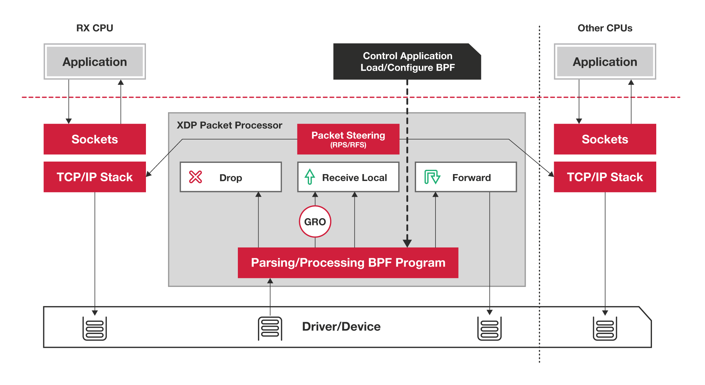

## 简介

在网络封包处理方面，出现过一种提升性能的技术 —— 内核旁路（Kernel Bypass ）：完全在用户空间实现网络驱动和整个网络栈，避免上下文切换、内核网络层次、中断处理。具体实现包括Intel的DPDK （Data Plane Development Kit）、Cisco的VPP等。

内核旁路技术的缺点是：

- 作为硬件资源的抽象层，内核是经过良好测试和验证的。在用户空间重新实现驱动，稳定性、可复用性欠佳
- 实现网络栈也是困难的
- 作为一个沙盒，网络处理程序难以和内核其它部分集成/交互
- 无法使用内核提供的安全层

`eXpress Data Path`，为内核提供了一个基于eBPF的、高性能的、可编程的、运行在驱动层的封包处理框架，它提升性能的思路和内核旁路技术相反 —— 完全在内核空间实现封包处理逻辑，例如过滤、映射、路由等。XDP通过在网络接收路径的最早期挂钩eBPF程序来实现高速封包过滤。最早期意味着：NIC驱动刚刚从receiver rings接收到封包，任何高成本操作，例如分配skb并将封包推入网络栈，尚未进行。



XDP对应的BPF程序类型是：BPF_PROG_TYPE_XDP。XDP程序可以读写封包，调用助手函数解析封包、计算Checksum，这些操作都不会牵涉系统调用的开销（都在内核空间执行）。

尽管XDP的基本用途是，尽早的决定封包是否应该丢弃。但是，由于网络函数无非是读、写、转发、丢弃等原语的组合，XDP可以用来实现任何网络功能。

XDP的主要优势包括：

- 可以使用各种内核基础设施，例如路由表、套接字、网络栈
- 运行在内核中，使用和内核其它部分一致的安全模型
- 运行在内核中，不需要跨越用户/内核空间边界，能够灵活的转发封包给其它内核实体，例如命名空间、网络栈
- 支持动态替换XDP程序，不会引起网络中断
- 保证封包的线性（linearly）布局，封包位于单个DMAed内存页中，访问起来很方便
- 保证封包有256字节可用的额外headroom，可以用于（使用助手函数 `bpf_xdp_adjust_head`、 `bpf_xdp_adjust_meta`）添加自定义的封装包头

从内核4.8+开始，主要发行版中XDP可用，大部分10G+网络驱动支持XDP。

## 应用场景

### DDoS缓解

XDP的高性能特征，让它非常适合实现DDoS攻击缓解，以及一般性防火墙。

### 封包转发

BPF程序可以对封包进行任意的修改，甚至是通过助手函数任意的增减headroom大小实现封装/解封装。

处理完的封包通过XDP_REDIRECT动作即可转发封包给其它NIC，或者转发给其它CPU（利用BPF的cpumap）

### 负载均衡

使用XDP_TX动作，hairpinned LB可以将修改后的封包从接收它的网卡发送回去。

### 流量采样和监控

XDP支持将部分或截断的封包内容存放到无锁的per-CPU的内存映射ring buffer中。此ring buffer由Linux perf基础设施提供，可以被用户空间访问。

## 编程接口

### XDP输入参数

XDP暴露的钩子具有特定的输入上下文，它是单一输入参数。它的类型为 `struct xdp_md`，在内核头文件 [bpf.h](https://elixir.bootlin.com/linux/latest/source/include/uapi/linux/bpf.h#L5738) 中定义，具体字段如下所示：

```c
struct xdp_md {
    // 内存页中，封包数据的开始点指针
    __u32 data;
    // 内存页中，封包数据的结束点指针
    __u32 data_end;
    // 最初和和data指向同一位置。后续可以被bpf_xdp_adjust_meta()调整，向data_hard_start方向移动
    // 可以用于为元数据提供空间。这种元数据对于正常的内核网络栈是不可见的，但是能够被tc BPF程序读取，
    // 因为元数据会从XDP传送到skb中
    // data_meta可以仅仅适用于在尾调用之间传递信息，类似于可被tc访问的skb->cb[]
    __u32 data_meta;
    /* Below access go through struct xdp_rxq_info */
    __u32 ingress_ifindex; /* rxq->dev->ifindex */
    __u32 rx_queue_index;  /* rxq->queue_index  */
};
 
// 接收队列信息
struct xdp_rxq_info {
    struct net_device *dev;
    u32 queue_index;
    u32 reg_state;
} ____cacheline_aligned; // 缓存线（默认一般是64KB），CPU以缓存线为单位读取内存到CPU高速缓存
```

它通过 `BPF context` 传递给XDP程序。

### XDP输出参数

在处理完一个数据包后，XDP程序会返回一个动作（Action）作为输出，它代表了程序退出后对数据包应该做什么样的最终裁决，也是在内核头文件 [bpf.h](https://elixir.bootlin.com/linux/latest/source/include/uapi/linux/bpf.h#L3298) 定义了以下5种动作类型：

```c
enum xdp_action {
    // 提示BPF出现错误，和DROP的区别仅仅是会发送一个trace_xdp_exception追踪点
    XDP_ABORTED = 0,
    // 应当在驱动层丢弃封包，不必再浪费额外资源。对于DDos缓和、一般性防火墙很有用
    XDP_DROP,
    // 允许封包通过，进入网络栈进行常规处理
    // 处理此封包的CPU后续将分配skb，将封包信息填充进去，然后传递给GRO引擎
    XDP_PASS,
    // 将封包从接收到的网络接口发送回去，可用于实现hairpinned LB
    XDP_TX,
    // 绕过正常的网络堆栈，重定向封包给另外一个NIC
    XDP_REDIRECT,
};
```

这个枚举是XDP程序需要返回的断言，告知驱动应该如何处理封包，可以看出这个动作的本质是一个int值。前面4个动作是不需要参数的，最后一个动作需要额外指定一个NIC网络设备名称，作为转发这个数据包的目的地。

## 程序编写

### 开发环境

```bash
sudo dnf install clang llvm gcc libbpf libbpf-devel libxdp libxdp-devel xdp-tools bpftool kernel-headers
```

### XDP程序

所有的包都会被丢弃，具体代码如下：

```c++
#include <linux/bpf.h>

/*
 * Comments from Linux Kernel:
 * Helper macro to place programs, maps, license in
 * different sections in elf_bpf file. Section names
 * are interpreted by elf_bpf loader.
 * End of comments

 * You can either use the helper header file below
 * so that you don't need to define it yourself:
 * #include <bpf/bpf_helpers.h> 
 */
#define SEC(NAME) __attribute__((section(NAME), used))

SEC("xdp_drop")
int xdp_drop_prog(struct xdp_md *ctx) {
    return XDP_DROP;
}

char _license[] SEC("license") = "GPL";
```

其中定义了一个函数，里面就一行代码，返回一个int类型，最后是代码许可证声明。做个简单的解释：

1. 第一部分是第一行的头文件`linux/bpf.h`，它包含了BPF程序使用到的所有结构和常量的定义（除了一些特定的子系统，如TC，它需要额外的头文件)。理论上来说，所有的eBPF程序第一行都是这个头文件。
2. 第二部分是第二行的宏定义，它的作用是赋予了`SEC(NAME)`这一串字符具有意义，即可以被编译通过。我截取了Linux内核代码里的注释，可以看出这段宏定义是为了ELF格式添加`Section`信息的。ELF全称是`Executable and Linkable Format`，就是可执行文件的一种主流格式（详细介绍点[这里](https://linux-audit.com/elf-binaries-on-linux-understanding-and-analysis/)），广泛用于Linux系统，我们的BPF程序一旦通过编译后，也会是这种格式。下面代码中的`SEC("xdp_drop")`和`SEC("license")`都是基于这个宏定义。
3. 第三部分，也就是我们的代码主体，它是一个命名为`xdp_drop_prog`函数，，返回值为int类型，接受一个参数，类型为`xdp_md`结构，上文已经介绍过，这个例子没有使用到这个参数。函数内的就是一行返回语句，使用`XDP_DROP`，也就是1，意思就是丢弃所有收到的数据包。
4. 第四部分是最后一行的许可证声明。这行其实是给程序加载到内核时BPF验证器看的，因为有些eBPF函数只能被具有GPL兼容许可证的程序调用。因此，验证器会检查程序所使用的函数的许可证和程序的许可证是否兼容，如果不兼容，则拒绝该程序。
还有一点，大家是否注意到整个程序是没有main入口的，事实上，程序的执行入口可以由前面提到的ELF格式的对象文件中的Section来指定。入口也有默认值，它是ELF格式文件中.text这个标识的内容，程序编译时会将能看到的函数放到.text里面。

### 编译XDP程序

利用clang命令行工具配合后端编译器LLVM来进行操作(相关介绍看[这里](https://davidlovezoe.club/ebpf-learning-001#%E5%A6%82%E4%BD%95%E7%BC%96%E5%86%99%E4%B8%80%E4%B8%AAeBPF%E7%A8%8B%E5%BA%8F))：

```bash
# -02: Moderate level of optimization which enables most optimizations，对生成的执行文件进行中等程度的优化
> clang -O2 -target bpf -c xdp-drop.c -o xdp-drop.o

# 查看生成的elf格式的可执行文件的相关信息
# 能看到上文提到的Section信息
> readelf -a xdp-drop.o
ELF 头：
  Magic：   7f 45 4c 46 02 01 01 00 00 00 00 00 00 00 00 00 
  类别:                              ELF64
  数据:                              2 补码，小端序 (little endian)
  Version:                           1 (current)
  OS/ABI:                            UNIX - System V
  ABI 版本:                          0
  类型:                              REL (可重定位文件)
  系统架构:                          Linux BPF
  版本:                              0x1
  入口点地址：               0x0
  程序头起点：          0 (bytes into file)
  Start of section headers:          272 (bytes into file)
  标志：             0x0
  Size of this header:               64 (bytes)
  Size of program headers:           0 (bytes)
  Number of program headers:         0
  Size of section headers:           64 (bytes)
  Number of section headers:         7
  Section header string table index: 1

节头：
  [号] 名称              类型             地址              偏移量
       大小              全体大小          旗标   链接   信息   对齐
  [ 0]                   NULL             0000000000000000  00000000
       0000000000000000  0000000000000000           0     0     0
  [ 1] .strtab           STRTAB           0000000000000000  000000ba
       0000000000000050  0000000000000000           0     0     1
  [ 2] .text             PROGBITS         0000000000000000  00000040
       0000000000000000  0000000000000000  AX       0     0     4
  [ 3] xdp_drop          PROGBITS         0000000000000000  00000040
       0000000000000010  0000000000000000  AX       0     0     8
  [ 4] license           PROGBITS         0000000000000000  00000050
       0000000000000004  0000000000000000  WA       0     0     1
  [ 5] .llvm_addrsig     LOOS+0xfff4c03   0000000000000000  000000b8
       0000000000000002  0000000000000000   E       6     0     1
  [ 6] .symtab           SYMTAB           0000000000000000  00000058
       0000000000000060  0000000000000018           1     2     8
Key to Flags:
  W (write), A (alloc), X (execute), M (merge), S (strings), I (info),
  L (link order), O (extra OS processing required), G (group), T (TLS),
  C (compressed), x (unknown), o (OS specific), E (exclude),
  p (processor specific)

There are no section groups in this file.

本文件中没有程序头。

There is no dynamic section in this file.

该文件中没有重定位信息。

The decoding of unwind sections for machine type Linux BPF is not currently supported.

Symbol table '.symtab' contains 4 entries:
   Num:    Value          Size Type    Bind   Vis      Ndx Name
     0: 0000000000000000     0 NOTYPE  LOCAL  DEFAULT  UND 
     1: 0000000000000000     0 FILE    LOCAL  DEFAULT  ABS xdp-drop.c
     2: 0000000000000000     4 OBJECT  GLOBAL DEFAULT    4 _license
     3: 0000000000000000    16 FUNC    GLOBAL DEFAULT    3 xdp_drop_prog

No version information found in this file.
```

还可以通过llvm-objdump这个工具来分析下这个可执行文件的反汇编指令信息：

```bash
> llvm-objdump -S xdp-drop.o
xdp-drop.o:  file format ELF64-BPF

Disassembly of section xdp:
xdp_drop:
       0:  b7 00 00 00 01 00 00 00   r0 = 1 # 1代表XDP_DROP，这句指令表示赋值1到代表返回值的寄存器r0
       1:  95 00 00 00 00 00 00 00   exit
```

### 加载XDP程序

由于我们的实验环境配置的网卡和网卡驱动都不支持`XDP hook`，所以肯定是用了 `xdpgeneric`模式。加载XDP程序就要用到ip这个命令行工具，它能帮助我们将程序加载到内核的`XDP Hook`上。上命令：

```sh
ip link set dev [device name] xdp obj xdp-drop.o sec [section name]
```

简单解释下：

1. `sec [section name]`就是上文提到的通过Section来指定程序入口
2. `device name`是本机某个网卡设备的名称，可以通过`ip a`查看本机所有的网卡设备。一般可以选取本机对外的IP所在的网卡设备。

因此完整的命令为：

```sh
# 查看主机的网卡设备列表，选取本机IP所在的网卡设备
> ip a
3: eth0: <BROADCAST,MULTICAST,UP,LOWER_UP> mtu 1500 qdisc fq_codel state UP group default qlen 1000
    link/ether 08:00:27:5c:7d:8f brd ff:ff:ff:ff:ff:ff
    inet 192.168.58.112/24 brd 192.168.58.255 scope global enp0s8
       valid_lft forever preferred_lft forever
    inet6 fe80::a00:27ff:fe5c:7d8f/64 scope link
       valid_lft forever preferred_lft forever
# 加载XDP程序到这个网卡设备上
> ip link set dev eth0 xdp obj xdp-drop.o sec xdp_drop verbose
# 如下信息就是没有报错，说明已经通过BPF验证器并attach到内核XDP hook上了
Prog section 'xdp' loaded (5)!
 - Type:         6
 - Instructions: 2 (0 over limit)
 - License:      GPL

Verifier analysis:

0: (b7) r0 = 1
1: (95) exit
processed 2 insns, stack depth 0
```

### 显示eBPF程序状态

```bash
bpftool prog show

3: cgroup_skb  tag 6deef7357e7b4530  gpl
	loaded_at 2022-05-22T15:26:07+0000  uid 0
	xlated 64B  jited 54B  memlock 4096B
4: cgroup_skb  tag 6deef7357e7b4530  gpl
	loaded_at 2022-05-22T15:26:07+0000  uid 0
	xlated 64B  jited 54B  memlock 4096B
5: cgroup_skb  tag 6deef7357e7b4530  gpl
	loaded_at 2022-05-22T15:26:07+0000  uid 0
	xlated 64B  jited 54B  memlock 4096B
6: cgroup_skb  tag 6deef7357e7b4530  gpl
	loaded_at 2022-05-22T15:26:07+0000  uid 0
	xlated 64B  jited 54B  memlock 4096B
7: cgroup_skb  tag 6deef7357e7b4530  gpl
	loaded_at 2022-05-22T15:26:09+0000  uid 0
	xlated 64B  jited 54B  memlock 4096B
8: cgroup_skb  tag 6deef7357e7b4530  gpl
	loaded_at 2022-05-22T15:26:09+0000  uid 0
	xlated 64B  jited 54B  memlock 4096B
13: cgroup_skb  tag 6deef7357e7b4530  gpl
	loaded_at 2022-05-22T15:26:10+0000  uid 0
	xlated 64B  jited 54B  memlock 4096B
14: cgroup_skb  tag 6deef7357e7b4530  gpl
	loaded_at 2022-05-22T15:26:10+0000  uid 0
	xlated 64B  jited 54B  memlock 4096B
45: xdp  name xdp_drop_prog  tag 57cd311f2e27366b  gpl
	loaded_at 2022-05-23T07:50:14+0000  uid 0
	xlated 16B  jited 18B  memlock 4096B
```

```bash
ip link show eth0

12: eth0@if13: <BROADCAST,MULTICAST,UP,LOWER_UP> mtu 1500 xdp qdisc noqueue state UP mode DEFAULT group default 
    link/ether 02:42:ac:11:00:02 brd ff:ff:ff:ff:ff:ff link-netnsid 0
    prog/xdp id 45 tag 57cd311f2e27366b jited
```

### 验证XDP程序的效果

测试场景很简单：

1. 从外部ping作为实验环境的虚拟机IP（就是上文中的192.168.58.112），期望是无法ping通。
2. 然后通过以下命令把XDP卸载掉，即detach from XDP hook，发现又能ping通。

### 卸载 XDP 程序

```bash
ip link set eth0 xdp off
```

### 执行更高级的操作

- 分析流量并仅丢弃 `IPv6` 数据包。

```c
#include <linux/bpf.h>
#include <linux/if_ether.h>
#include <bpf/bpf_helpers.h>
#include <arpa/inet.h>

SEC("xdp_drop_ipv6")
int xdp_drop_prog(struct xdp_md *ctx)
{
    void *data_end = (void *)(long)ctx->data_end;
    void *data = (void *)(long)ctx->data;
    struct ethhdr *eth = data;
    __u16 h_proto;

    if (data + sizeof(struct ethhdr) > data_end)
        return XDP_DROP;

    h_proto = eth->h_proto;

    if (h_proto == htons(ETH_P_IPV6))
        return XDP_DROP;

    return XDP_PASS;
}

char _license[] SEC("license") = "GPL";
```

## Ingress or Egress

上面的测试场景是验证了经过目标网络设备的Ingress流量被我们的XDP程序drop了，专业术语叫RX流向。那么Egress流量是否也会被drop掉呢？

答案是，不会。XDP hook不会作用到Egress流量，也就是TX流向。读者可以自行在已经attach XDP程序的实验环境中，ping一个外部地址，请保证这次请求会经过被attach XDP程序的网络设备。其结果就是请求没有收到任何影响。