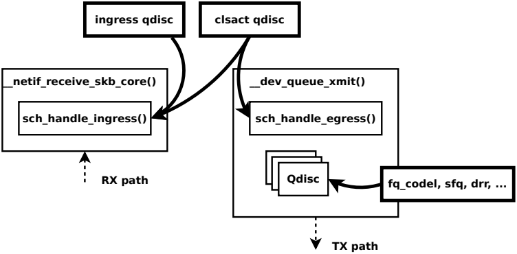

# 简介

## TC 简介

在介绍 direct-action 之前，需要先回顾一下 Linux TC 的经典使用场景和使用方式。TC全称「Traffic Control」，即「流量控制」，流量控制最终是在内核中完成的：`TC` 模块根据不同算法对网络设备上的流量进行控制 （限速、设置优先级等等）。用户一般通过 iproute2 中的 `TC` 工具完成配置 —— 这是与内核 TC 子系统相对应的用户侧工具 —— 二者之间（大部分情况下）通过 Netlink 消息通信。

BPF可以和内核的TC层一起工作。TC程序和XDP程序有以下不同：

1. TC程序的BPF输入上下文是`struct __sk_buff`，而非`struct xdp_md`。在XDP之后，内核会解析封包，存入skb_buff。解析的开销导致TC程序的性能远低于XDP，但是，TC程序可以访问skb的mark, pkt_type, protocol, priority, queue_mapping, napi_id, cb[]数组, hash, tc_classid, tc_index等字段，以及VLAN元数据、XDP传送来的自定义元数据。BPF上下文 `struct __sk_buff`定义在 [include/uapi/linux/bpf.h](https://elixir.bootlin.com/linux/v5.6.7/source/include/uapi/linux/bpf.h#L3120)

2. TC程序可以挂钩到`ingress/egress`网络路径上，XDP则仅仅能挂钩到`ingress`路径
TC程序对驱动层没有依赖，可以挂钩到任何类型的网络设备。除非启用TC BPF程序的offloading
尽管TC程序的挂钩点没有XDP那么早，但是仍然是在内核网络路径的早期。它在GRO运行之后，任何协议处理之前执行。iptables PREROUTING、nftables ingress hook等工具也在相同的位置挂钩。

### TC 术语

TC 是一个强大但复杂的框架（且[文档](https://qmonnet.github.io/whirl-offload/2016/09/01/dive-into-bpf/#about-tc)较少）。 它的几个核心概念：

- queueing discipline (qdisc)：排队规则，根据某种算法完成限速、整形等功能
- class：用户定义的流量类别
- classifier (也称为 filter)：分类器，分类规则
- action：要对包执行什么动作

组合以上概念，下面是对某个网络设备上的流量进行分类和限速时，所需完成的大致步骤：

1. 为网络设备创建一个 qdisc。

    - qdisc 是一个整流器/整形器（shaper），可以包含多个 class，不同 class 可以应用不同的策略。
    - qdisc 需要附着（attach）到某个网络接口（network interface），及流量方向（ingress or egress）。

2. 创建流量类别（class），并 attach 到 qdisc。

    - 例如，根据带宽分类，创建高、中、低三个类别。

3. 创建 filter（classifier），并 attach 到 qdisc。

filters 用于对网络设备上的流量进行分类，并将包分发（dispatch）到前面定义的不同 class。

filter 会对每个包进行过滤，返回下列值之一：

    - 0：表示 mismatch。如果后面还有其他 filters，则继续对这个包应用下一个 filter。
    - -1：表示这个 filter 上配置的默认 classid。
    - 其他值：表示一个 classid。系统接下来应该将包送往这个指定的 class。可以看到，通过这种方式可以实现非线性分类（non-linear classification）。

4. 另外，可以给 filter 添加 action。例如，将选中的包丢弃（drop），或者将流量镜像到另一个网络设备等等。

5. 除此之外，qdisc 和 class 还可以循环嵌套，即： class 里加入新 qdisc，然后新 qdisc 里又可以继续添加新 class， 最终形成的是一个以 root qdisc 为根的树。但对于本文接下来的内容，我们不需要了解这么多。

### TC 示例：匹配 IP 和 Port 对流量进行分类

下面是一个例子，（参考了 [HTB shaper 文档](http://luxik.cdi.cz/~devik/qos/htb/manual/userg.htm)）：

```js
# x:y 格式：
# * x 表示 qdisc, y 表示这个 qdisc 内的某个 class
# * 1: 是 1:0 的简写
#
# "default 11"：any traffic that is not otherwise classified will be assigned to class 1:11
$ tc qdisc add dev eth0 root handle 1: htb default 11

$ tc class add dev eth0 parent 1: classid 1:1 htb rate 100kbps ceil 100kbps
$ tc class add dev eth0 parent 1:1 classid 1:10 htb rate 30kbps ceil 100kbps
$ tc class add dev eth0 parent 1:1 classid 1:11 htb rate 10kbps ceil 100kbps

$ tc filter add dev eth0 protocol ip parent 1:0 prio 1 u32 \
    match ip src 1.2.3.4 match ip dport 80 0xffff flowid 1:10
$ tc filter add dev eth0 protocol ip parent 1:0 prio 1 u32 \
    match ip src 1.2.3.4 action drop
```

以上设置表示以下顺序逻辑：

1. 如果包匹配 `src_ip==1.2.3.4 && dst_port==80`，则将其送到第一个队列。这个队列对应的 class 目标速率是 `30kbps`；否则，
2. 如果包匹配 `src_ip==1.2.3.4`，则将其 drop；
3. 所有其他包将被送到第二个队列，对应的 class 目标速率是 `10kbps`。

### TC eBPF 程序

本质上，eBPF 是一种类汇编语言，能编写运行在内核的、安全的程序。 eBPF 程序能 attach 到内核中的若干 hook 点，其中大部分 hook 点 都是用于包处理（packet processing）和监控（monitoring）目的的。

这些 hook 中有两个与 TC 相关：从内核 4.1 开始，eBPF 程序能作为 tc classifier 或 tc action 附着（attach）到这两个 hook 点。

#### 用作 classifier（分类器）

作为分类器使用时，eBPF 能使处理过程更灵活，甚至还能实现有状态处理，或者与用户 态交互（通过名为 map 的特殊数据结构）。

但这种场景下的 eBPF 程序本质上还是一个分类器，因此返回值与普通分类器并无二致：

- 0：mismatch
- -1：match，表示当前 filter 的默认 classid
- 其他值：表示 classid

#### 用作 action（动作）

用作 action 时，eBPF 程序的返回值 提示系统接下来对这个包执行什么动作（action），下面的内容来自 tc-bpf(2)：

1. TC_ACT_UNSPEC (-1)：使用 tc 的默认 action（与 classifier/filter 返回 -1 时类似）。
2. TC_ACT_OK (0)：结束处理过程，放行（allows the packet to proceed）。
3. TC_ACT_RECLASSIFY (1)：从头开始，重新执行分类过程。
4. TC_ACT_SHOT (2)：丢弃包。
5. TC_ACT_PIPE (3)：如果有下一个 action，执行之。
6. 其他值：定义在 [include/uapi/linux/pkt_cls.h](https://git.kernel.org/pub/scm/linux/kernel/git/torvalds/linux.git/tree/include/uapi/linux/pkt_cls.h)。 [BPF and XDP Reference Guide from Cilium](http://docs.cilium.io/en/latest/bpf/#tc-traffic-control) 有进一步介绍。
7. 没有定义在以上头文件中的值，属于未定义返回值（unspecified return codes）。

*从 `TC_ACT_UNSPEC` 开始，表示"未指定的action"，用于以下三种场景：i)当一个offloaded tc程序的tc ingress钩子运行在cls_bpf的位置，则该offloaded程序将返回 `TC_ACT_UNSPEC`；ii)为了在多程序场景下继续执行cls_bpf中的下一个BPF程序，后续的程序需要与步骤i中的offloaded tc BPF程序配合使用，但出现了一个非offloaded场景下运行的tc BPF程序；iii)`TC_ACT_UNSPEC` 还可以用于单个程序场景，用于告诉内核继续使用skb，不会产生其他副作用。`TC_ACT_UNSPEC` 与 `TC_ACT_OK` 类似，两者都会将skb通过ingress向上传递到网络栈的上层，或者通过egress向下传递到网络设备驱动程序，以便在egress进行传输。与 `TC_ACT_OK` 的唯一不同之处是，`TC_ACT_OK` 基于tc BPF程序设定的classid来设置 skb->tc_index，而 `TC_ACT_UNSPEC` 是通过 tc BPF 程序之外的 BPF上下文中的 skb->tc_classid 进行设置。*

更多详细文档查看[这里](https://arthurchiao.art/blog/understanding-tc-da-mode-zh/)

### TC 程序工作方式

工作在TC层的BPF程序，是从一个名为 `cls_bpf` 的过滤器运行的。TC程序不但可以读取skb的元数据、封包内容，还能够对封包进行任意修改，甚至使用action verdict终止tc处理过程。

过滤器`cls_bpf`可以挂钩1-N个BPF程序，当有多个BPF程序情况下，前面的程序返回verdict TC_ACT_UNSPEC会导致继续执行后面的BPF程序。使用多个BPF程序的缺点是，需要反复解析封包，导致性能降低。

`cls_bpf`有一个`direct-action（da）`模式，这样BPF程序能够直接返回action verdict，决定封包命运，结束TC处理流水线。

TC BPF程序也支持在运行时动态更新，而不会中断任何网络流量。

`cls_bpf`可以挂钩到的`ingress/egress`钩子，均被一个伪（不在qdisc树形结构中）排队规则 `sch_clsact` 管理。对于ingress qdisc来说，sche_clsact可以作为一个drop-in的替代品。对于在 `__dev_queue_xmit()` 中执行的egress钩子，需要强调，sche_clsact不在内核的root qdisc锁下运行。因此，不管是ingress/egress，使用sche_clsact时TC BPF程序都是以无锁方式执行的，这和典型的qdisc完全不同。此外需要注意，sch_clsact执行期间不会发生抢占。

典型情况下，egress方向会有附到网络设备的qdisc，例如sch_htb、sch_fq，它们其中有些是classful qdisc。classful qdisc会通过 tcf_classify() 调用分类器，cls_bpf也可以被挂到这种qdisc上。这时，BPF程序在root qdisc下运行，可能面临锁争用问题。

为了达到最大性能（减少锁争用），可以考虑这样的用法：使用sch_clsact + cls_bpf，在root qdisc锁之外，完成任务繁重的封包分类工作，并且设置skb->mark或skb->priority。然后，由运行在root qdisc锁下的sch_htb快速的根据skb字段完成分类、塑形操作。

sch_clsact + cls_bpf组合使用时，如果cls_bpf是da模式、只包含单个BPF程序、且位于ingress网络路径，则支持offload给智能网卡。

## 应用场景

### 容器网络策略

对于容器来说，容器网络命名空间和初始网络命名空间通过一对veth连接。我们可以在宿主机端实现网络策略：

1. 主机侧的egress，对应容器的ingress
2. 主机侧的ingress，对应容器的egress



`ingress`钩子在内核中由 `__netif_receive_skb_core() -> sch_handle_ingress()`调用。

`egress`钩子在内核中由 `__dev_queue_xmit() -> sch_handle_egress()`调用。
clsact是以无锁方式处理的，支持挂钩到虚拟的、没有队列概念的网络设备，例如veth。
将TC BPF程序挂钩到宿主机veth的egress/ingress钩子即可。

对于veth这样的虚拟设备，XDP是不适合的。因为内核在虚拟设备这里，单纯在一个skb上操作，XDP由于一些限制，无法和克隆的skb一起工作。克隆skb在内核TCP/IP栈被大量使用，用来存放重传的数据段，这里XDP钩子会被直接跳过。此外，XDP需要线性化（放到单个页）整个skb，这也导致严重的性能影响。

### 转发和负载均衡

容器工作负载的东西向流量是主要的目标场景。

不像XDP仅作用在ingress上，TC BPF可以在某些场景下，应用到容器egress方向。在对容器透明的前提下，可以利用BPF在egress进行NAT和LB处理，利用`bpf_redirection`助手函数，BPF可以将封包转到任何接口的ingress/egress路径，不需要网桥之类的设备辅助。

### 流采样和监控

类似XDP，流采样和监控可以通过高性能、无锁的per-CPU内存映射的`perf ring buffer`实现，依此TC BPF程序可以调用助手函数 `bpf_skb_event_output()` 推送定制数据、完整/截断的封包内容到用户空间。

由于TC BPF程序可以同时挂到ingress/egress，因此可以为任何节点实现双向的监控。

BPF程序可以预先做一些聚合，而不是把所有东西推送到用户空间。

### 预处理封包调度

如上文所提到，sch_clsact的egress钩子，即 `sch_handle_egress()`，在获取内核qdisc root锁之前运行。这种无锁的特征让TC BPF程序适合执行较重（耗时）的分类任务，并将分类结果设置到skb的某些字段，在后续交由常规的、有锁的qdisc进行塑形和重排。

## 编程接口

### TC 输入参数

TC接受单个输入参数，类型为`struct __sk_buff`。这个结构是一种UAPI（user space API of the kernel），允许访问内核中`socket buffer`内部数据结构中的某些字段。它具有与 `struct xdp_md` 相同意义两个指针，`data`和`data_end`，同时还有更多信息可以获取，这是因为在TC层面上，内核已经解析了数据包以提取与协议相关的元数据，因此传递给BPF程序的上下文信息更加丰富。结构 `__sk_buff` 的整个声明如下所说，可以在 [include/uapi/linux/bpf.h](https://elixir.bootlin.com/linux/v5.6.7/source/include/uapi/linux/bpf.h#L3120) 文件中看到，下面是结构体的定义，比XDP的要多出很多信息，这就是为什么说TC层的吞吐量要比XDP小了，因为实例化一堆信息需要很大的cost。

```c++
* user accessible mirror of in-kernel sk_buff.
 * new fields can only be added to the end of this structure
 */
struct __sk_buff {
  __u32 len;
  __u32 pkt_type;
  __u32 mark;
  __u32 queue_mapping;
  __u32 protocol;
  __u32 vlan_present;
  __u32 vlan_tci;
  __u32 vlan_proto;
  __u32 priority;
  __u32 ingress_ifindex;
  __u32 ifindex;
  __u32 tc_index;
  __u32 cb[5];
  __u32 hash;
  __u32 tc_classid;
  __u32 data;
  __u32 data_end;
  __u32 napi_id;

  /* Accessed by BPF_PROG_TYPE_sk_skb types from here to ... */
  __u32 family;
  __u32 remote_ip4;  /* Stored in network byte order */
  __u32 local_ip4;  /* Stored in network byte order */
  __u32 remote_ip6[4];  /* Stored in network byte order */
  __u32 local_ip6[4];  /* Stored in network byte order */
  __u32 remote_port;  /* Stored in network byte order */
  __u32 local_port;  /* stored in host byte order */
  /* ... here. */

  __u32 data_meta;
  __bpf_md_ptr(struct bpf_flow_keys *, flow_keys);
  __u64 tstamp;
  __u32 wire_len;
  __u32 gso_segs;
  __bpf_md_ptr(struct bpf_sock *, sk);
};
```

### TC 输出参数

和XDP一样，TC的输出代表了数据包如何被处置的一种动作。它的定义在[include/uapi/linux/pkt_cls.h](https://elixir.bootlin.com/linux/v5.6.7/source/include/uapi/linux/pkt_cls.h#L38)找到。最新的内核版本里定义了9种动作，其本质是int类型的值，以下是5种常用动作：

```c++
// 未指定，如果有多个BPF程序，会继续运行下一个。如果没有更多BPF程序
// 则提示内核在没有任何side-effect的情况下继续处理skb
#define TC_ACT_UNSPEC         (-1)
// 从tc BPF程序角度，TC_ACT_OK、TC_ACT_RECLASSIFY等价
#define TC_ACT_OK               0
// 提示内核丢弃封包，在ingress方向，网络栈上层无法看到封包；在egress方向，封包不会被发出
#define TC_ACT_SHOT             2
// 从tc BPF程序角度，TC_ACT_STOLEN、TC_ACT_QUEUED、TC_ACT_TRAP等价
// 类似于TC_ACT_SHOT，区别：
//   TC_ACT_SHOT导致内核通过kfree_skb()释放封包并返回NET_XMIT_DROP作为即时的反馈
//   TC_ACT_STOLEN导致内核通过consume_skb()释放封包，并且返回NET_XMIT_SUCCESS，
//      效果是上层以为封包是成功发送的
#define TC_ACT_STOLEN           4
// 利用助手函数bpf_redirect()，重定向封包到相同/不同设备的ingress/egress路径
#define TC_ACT_REDIRECT         7 
```

## 程序编写

### 开发环境

```
sudo dnf install clang llvm gcc libbpf libbpf-devel libxdp libxdp-devel xdp-tools bpftool kernel-headers
```

### TC程序

丢弃所有基于TCP协议的数据包，具体代码如下：

```c
#include <stdbool.h>
#include <linux/bpf.h>
#include <linux/if_ether.h>
#include <linux/ip.h>
#include <linux/in.h>
#include <linux/pkt_cls.h>

#include "bpf_endian.h"
#include "bpf_helpers.h"

// static bool is_TCP(void *data_begin, void *data_end);

/*
  check whether the packet is of TCP protocol
*/
static bool is_TCP(void *data_begin, void *data_end){
  struct ethhdr *eth = data_begin;

  // Check packet's size
  // the pointer arithmetic is based on the size of data type, current_address plus int(1) means:
  // new_address= current_address + size_of(data type)
  if ((void *)(eth + 1) > data_end) //
    return false;

  // Check if Ethernet frame has IP packet
  if (eth->h_proto == bpf_htons(ETH_P_IP))
  {
    struct iphdr *iph = (struct iphdr *)(eth + 1); // or (struct iphdr *)( ((void*)eth) + ETH_HLEN );
    if ((void *)(iph + 1) > data_end)
      return false;

    // Check if IP packet contains a TCP segment
    if (iph->protocol == IPPROTO_TCP)
      return true;
  }

  return false;
}

SEC("xdp")
int xdp_drop_tcp(struct xdp_md *ctx)
{

  void *data_end = (void *)(long)ctx->data_end;
  void *data = (void *)(long)ctx->data;

  if (is_TCP(data, data_end))
    return XDP_DROP;

  return XDP_PASS;
}

SEC("tc")
int tc_drop_tcp(struct __sk_buff *skb)
{

  void *data = (void *)(long)skb->data;
  void *data_end = (void *)(long)skb->data_end;

  if (is_TCP(data, data_end)) 
    return TC_ACT_SHOT;

  return TC_ACT_OK;
}

char _license[] SEC("license") = "GPL";
```

代码关键点作以下说明：

1. 代码结构上定义了两个`Section`作为XDP和TC的入口，还有一个 `is_TCP` 功能函数，判断是否是TCP网络包，供两个`Section`调用。这样做的好处是只要维护一份代码文件，根据Section名称，分别给`XDP hook`和`TC hook`加载。
2. 这次的include的header文件很多，其中 `bpf_endian.h`和`bpf_helpers`是本地引用的头文件，其实是从内核代码的[这个位置](https://elixir.bootlin.com/linux/v4.15/source/tools/testing/selftests/bpf)复制过来的，这个是参照了[sample/bpf](https://elixir.bootlin.com/linux/v4.15/source/samples/bpf/)里面示例代码的做法。它们都是工具类函数集合，在写复杂逻辑时非常有用。

3. 在is_TCP 这个函数里，有如下这一段：

```c
if ((void *)(eth + 1) > data_end)
    return false;
```

它有两层含义：

- 括号里运算式`eth+1`是个非常有趣的表达式，它的本质是指针运算，指针变量+1就是指针向右移动n个字节，这个n为该指针变量指向的对象类型的字节长度，这里就是`struct ethhdr`的字节长度，为14个字节，可以在[这个内核头文件](https://elixir.bootlin.com/linux/v4.15/source/include/uapi/linux/if_ether.h)里找到相关定义：

```c
struct ethhdr {
  // ETH_ALEN 为6个字节
  unsigned char  h_dest[ETH_ALEN]; /* destination eth addr */
  unsigned char  h_source[ETH_ALEN]; /* source ether addr */
  // __be16 为16 bit，也就是2个字节
  __be16   h_proto; /* packet type ID field */
}
// 所以整个struct就是14个字节长度。
```

如果不使用指针运算，还是作显式的长度判断，如下所示：

```c
u64 h_offset;
struct ethhdr *eth = data;
// 显式声明并赋值ethhdr长度
h_offset = sizeof(*eth);
// 根据左右变量类型，运算符号加号重载成相关运算机制
if (data + h_offset > data_end)
    return false; 
```

另外，注意观察`(eth + 1)`前面加了一个显示类型转换，如果不做这个操作，编译时会有如下warning。代码里其他类似这样的显示类型转换都是出于规避编译warning的考虑。

```c
warning: comparison of distinct pointer types
('struct ethhdr *' and 'void *') [-Wcompare-distinct-pointer-types]
if (eth + 1 > data_end)
    ~~~~~~~ ^ ~~~~~~~~
1 warning generated.
```

那整体的if语句判断目的是什么呢？目的是判断括号内运算结果会不会内存越界，这对于BPF验证器来说是必要的，如果没有，BPF验证器会阻止这个程序加载到内核中。由于我们需要通过右移data变量获取到IP头，如下代码为获取IP头：

```c
struct iphdr *iph = (struct iphdr *)(eth + 1);
```

因此需要判断这个右移结果是否有效，如果无效，就直接return出去了，防止内存越界。类似的右移判断逻辑在BPF程序里出现频次会很高，一定要做好边界判断逻辑。

### 编译代码

跟XDP程序一样，可以使用clang进行编译，不同之处是由于引用了本地头文件，所以需要加上`-I`参数，指定头文件所在目录：

```c
clang -I ./headers/ -O2 -target bpf -c tc-xdp-drop-tcp.c -o tc-xdp-drop-tcp.o
```

### 加载到内核

#### TC加载简介
如同`XDP BPF`程序可以通过`ip`命令进行加载，只要你安装了`iproute2`，也可以通过tc命令加载TC BPF程序。上文提到的了TC控制的单元是qdisc，用来加载BPF程序是个特殊的qdisc叫`clsact`，示例命令如下所示：

```bash
# 为目标网卡创建clsact
tc qdisc add dev [network-device] clsact
# 加载bpf程序
tc filter add dev [network-device] <direction> bpf da obj [object-name] sec [section-name]
# 查看
tc filter show dev [network-device] <direction>
```

简单说明下：

- 示例中有个参数`<direction>`，它表示将bpf程序加载到哪条网络链路上，它的值可以是`ingress`和`egress`。
- 还有一个不起眼的参数da，它的全称是`direct-action`。查看帮助文档：

```c
direct-action | da
instructs eBPF classifier to not invoke external TC actions, instead use the TC actions return codes (TC_ACT_OK, TC_ACT_SHOT etc.) for classifiers.
```

为了了解并学习容器网络Cilium的工作原理，这次拿容器实例作为流控目标。在实验环境上通过`docker run`运行一个Cilium服务：

```docker
docker run --privileged --name ebpf -v /home/sino/ebpf/ebpf-examples.git:/data -d quay.io/cilium/cilium:v1.11.3 sleep infinity

mount bpffs -t bpf /sys/fs/bpf
```

这样主机层就会多出一个`veth`网络设备，与容器里的`eth0`形成`veth pair`，流量都是通过这对`veth pair`。因此我们可以将XDP程序`attach`到主机层的veth网络设备上，以此控制容器流量：

```sh
> ip a | grep veth
6: veth5225aac@if5: <BROADCAST,MULTICAST,UP,LOWER_UP> mtu 1500 qdisc noqueue master docker0 state UP group default
# 加载XDP BPF程序
> ip link set dev veth5225aac xdp obj tc-xdp-drop-tcp.o sec xdp
```

下面是结合容器实现TC BPF控制Egress的真实命令：

```
# 最开始的状态
> tc qdisc show dev veth5225aac
qdisc noqueue 0: root refcnt 2

# 创建clsact
> tc qdisc add dev veth5225aac clsact

# 再次查看，观察有什么不同
> tc qdisc show dev veth5225aac
qdisc noqueue 0: root refcnt 2
qdisc clsact ffff: parent ffff:fff1

# 加载TC BPF程序到容器的veth网卡上
> tc filter add dev veth5225aac egress bpf da obj tc-xdp-drop-tcp.o sec tc

# 再次查看，观察有什么不同
> tc qdisc show dev veth5225aac
qdisc noqueue 0: root refcnt 2
qdisc clsact ffff: parent ffff:fff1

> tc filter show dev veth5225aac egress
filter protocol all pref 49152 bpf chain 0
filter protocol all pref 49152 bpf chain 0 handle 0x1 tc-xdp-drop-tcp.o:[tc] direct-action not_in_hw id 24 tag 9c60324798bac8be jited

可以看到 tc-xdp-drop-tcp.o 中的 filter 已经 attach 到 ingress 路径，并且使用了 direct-action 模式。 现在这段对流量进行分类+执行动作（classification and action selection）程序已经开始工作了。
```

#### 编译

将编译成功后输出的`tc-xdp-drop-tcp.o`文件，通过tc命令行加载到指定网卡设备上去。下面是使用verbose模式后的加载结果，可以看到BPF验证器通过检查`tc-xdp-drop-tcp.o`文件包含的BPF instructions，保障了加载到内核的安全性。


```c
> tc filter add dev veth09e1d2e egress bpf da obj tc-xdp-drop-tcp.o sec tc verbose
Prog section 'tc' loaded (5)!
 - Type:         3
 - Instructions: 19 (0 over limit)
 - License:      GPL
Verifier analysis:
0: (61) r2 = *(u32 *)(r1 +80)
1: (61) r1 = *(u32 *)(r1 +76)
2: (bf) r3 = r1
3: (07) r3 += 14
4: (2d) if r3 > r2 goto pc+12
 R1=pkt(id=0,off=0,r=14,imm=0) R2=pkt_end(id=0,off=0,imm=0) R3=pkt(id=0,off=14,r=14,imm=0) R10=fp0
5: (bf) r3 = r1
6: (07) r3 += 34
7: (2d) if r3 > r2 goto pc+9
 R1=pkt(id=0,off=0,r=34,imm=0) R2=pkt_end(id=0,off=0,imm=0) R3=pkt(id=0,off=34,r=34,imm=0) R10=fp0
8: (71) r2 = *(u8 *)(r1 +13)
9: (67) r2 <<= 8
10: (71) r3 = *(u8 *)(r1 +12)
11: (4f) r2 |= r3
12: (57) r2 &= 65535
13: (55) if r2 != 0x8 goto pc+3
 R1=pkt(id=0,off=0,r=34,imm=0) R2=inv8 R3=inv(id=0,umax_value=255,var_off=(0x0; 0xff)) R10=fp0
14: (b7) r0 = 2
15: (71) r1 = *(u8 *)(r1 +23)
16: (15) if r1 == 0x6 goto pc+1
 R0=inv2 R1=inv(id=0,umax_value=255,var_off=(0x0; 0xff)) R2=inv8 R3=inv(id=0,umax_value=255,var_off=(0x0; 0xff)) R10=fp0
17: (b7) r0 = 0
18: (95) exit
from 16 to 18: R0=inv2 R1=inv6 R2=inv8 R3=inv(id=0,umax_value=255,var_off=(0x0; 0xff)) R10=fp0
18: (95) exit
from 13 to 17: safe
from 7 to 17: safe
from 4 to 17: safe
processed 23 insns, stack depth 0
```

#### 验证TC程序的效果

测试场景很简单：

- 从容器里访问外部服务，期望是无法请求通。
```
curl --dns-servers 8.8.8.8 www.baidu.com
```
- 然后通过以下命令把TC卸载掉，发现又能请求通。

#### 卸载 TC 程序

```sh
tc qdisc del dev veth5225aac clsact
```

### TC和BPF亲密合作

用到了一个参数da，它的全称是「direct action」。其实它是TC支持BPF后的「亲密合作」的产物。

对于tc filter来说，一般在命中过滤条件后需要指定下一步操作动作，如：


```c
# 一个没有使用bpf的tc filter
tc filter add dev eth0 protocol ip parent 1:0 prio 1 u32 \
    match ip src 1.2.3.4 action drop
```

注意到这个`tc filter`后面跟了一个`action drop`，意思是命中过滤条件后将网络包丢弃，而这个操作动作如果我们使用BPF程序，其实就是已经定义在程序里了。为了避免重复指定，内核引入了da模式，告诉TC请repect BPF程序提供的返回值，无需再手动指定action了，节省了调用action模块的开销，这也是目前`TC with BPF`的推荐做法。[这篇文章](https://qmonnet.github.io/whirl-offload/2020/04/11/tc-bpf-direct-action/)对此作了详细介绍。
